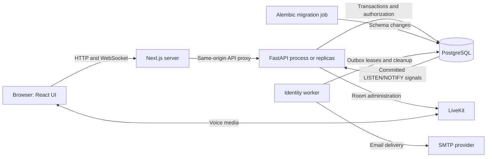
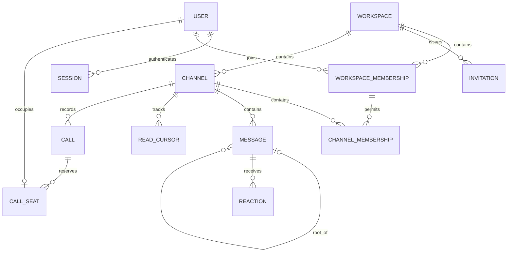
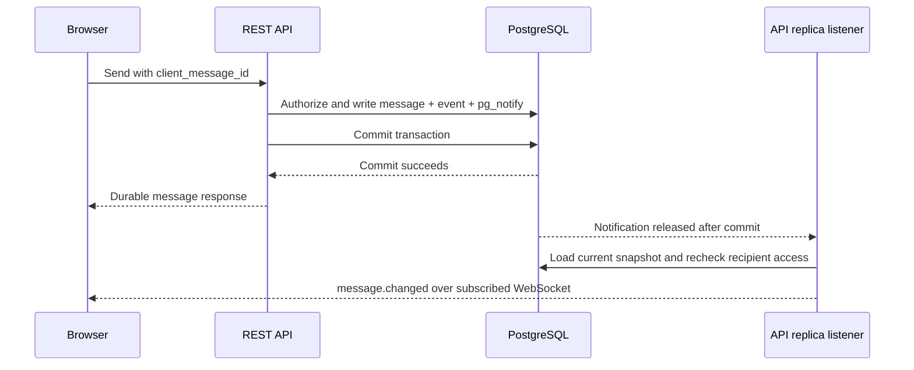
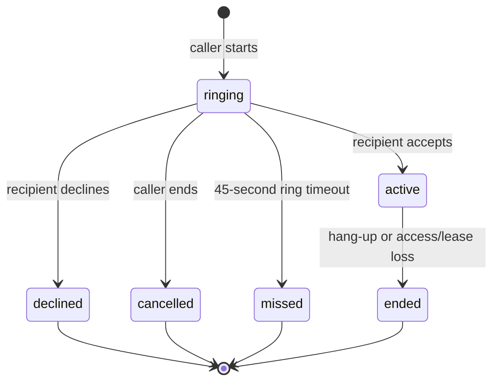

# Klack architecture

[Documentation index](../README.md) · [API guide](../api.md) · [Decision records](../adr/README.md)

Klack is a modular monolith: one feature-oriented backend codebase and one PostgreSQL database,
with separate API, migration, and identity-worker processes. PostgreSQL owns durable state and
authorization. The Next.js frontend presents the app and proxies browser API traffic. LiveKit
transports voice; it does not own Klack conversation permissions or call history.

## Runtime topology

The development [Compose stack](../../compose.yaml) runs PostgreSQL, a one-shot migration job,
the API, and the identity worker. The frontend runs separately. Each API process has its own
SQLAlchemy pool, local WebSocket connections, dedicated PostgreSQL listener, and background
realtime tasks. Call maintenance also runs in each API process when LiveKit is configured.
There is no required Redis service or separate message broker.

## Backend composition and boundaries

[`bootstrap.py`](../../backend/src/klack/bootstrap.py) builds the FastAPI app and manages process
lifecycle. The typed [container](../../backend/src/klack/core/container.py) creates shared settings,
security helpers, policies, the async engine, session factory, and realtime broker. Construction
does not open database connections; lifespan starts background work and disposes resources on shutdown.
Request/task scopes receive their own `AsyncSession`. Dependencies do not auto-commit; services
and repositories control transaction completion. Alembic alone changes the schema.

| Module | Responsibilities | Durable state |
| --- | --- | --- |
| [Identity](../../backend/src/klack/modules/identity) | Passwords, sessions, refresh rotation, email actions, throttles | Users, credentials, sessions, refresh tokens, action tokens, outbox, throttle buckets |
| [Workspaces](../../backend/src/klack/modules/workspaces) | Tenant membership, roles, ownership, invitations | Workspaces, memberships, invitation digests |
| [Channels](../../backend/src/klack/modules/channels) | Discovery, explicit membership, visibility, archival | Channels and channel memberships |
| [Messaging](../../backend/src/klack/modules/messaging) | History, sends, edits, deletion, threads, reactions, read positions, DM workflows | Messages, reactions, read cursors; coordinates direct-conversation channel state |
| [Realtime](../../backend/src/klack/modules/realtime) | Committed event fanout and authenticated subscriptions | Body-free event rows; sockets and queues remain process-local |
| [Calling](../../backend/src/klack/modules/calling) | Private voice authorization, call transitions, participant reservations, room cleanup | Calls and exclusive participant seats |

Identity, workspaces, channels, and messaging use `domain/`, `application/`, `infrastructure/`,
and `api/` directories. Domain types describe rules and errors; application services coordinate
use cases through ports; infrastructure implements persistence/security; API modules translate
HTTP requests and responses. Realtime follows a similar split for connection management and delivery.

Calling currently uses a flatter `router.py`, `service.py`, `models.py`, and `worker.py` layout,
with direct access to identity and membership records. Conversation infrastructure also coordinates
channel state. These are existing implementation couplings, not independent services. When extending
the system, keep ownership explicit and follow [ADR 0001](../adr/0001-modular-monolith.md); avoid
introducing generic shared business services or cross-module ORM object graphs.

## Data model and authorization

This is a conceptual relationship diagram; [migrations](../../backend/alembic/versions) and model
definitions contain the exact columns, indexes, constraints, and deletion rules.

- JWTs identify a user/session; durable session and membership checks determine current access.
  Role changes and removals do not wait for JWT renewal.
- Channel membership is contained within workspace membership. Public discovery does not grant
  content access. Governance access to private channel metadata does not grant message access.
- Direct conversations reuse channel-backed messages but hide from channel discovery and prevent
  administrators from joining, changing participants, or converting them to public channels.
- Threads are one level deep. Replies point to a root in the same channel; deleting a root leaves
  its thread addressable. Deleted message bodies are erased while tombstones preserve ordering.
- Read cursors belong to a user and conversation, advance monotonically by `(created_at, id)`, and
  are private positions rather than shared read receipts.
- Workspace row locks serialize sensitive membership operations; refresh rotation, read updates,
  and call transitions use database coordination to preserve their own concurrency guarantees.

## Browser authentication boundary

Browser traffic uses the frontend origin and `/api/v1` proxy. Access and refresh credentials are
host-only HttpOnly cookies, never JavaScript storage. Unsafe requests require the exact configured
Origin; authenticated mutations additionally require the readable CSRF cookie value in
`X-CSRF-Token`, bound to the durable session. The proxy preserves this boundary instead of rewriting Origin.

Passwords use bounded, off-event-loop Argon2id work. Refresh tokens are opaque, stored as HMAC
digests, and rotated under row locks; consumed-token replay revokes the session family. Email
actions are single-use and purpose-bound, with encrypted transactional outbox delivery. Workspace
invitation tokens are stored as HMAC digests using a separate secret, manually shared, and independent of SMTP.
See [identity decisions](../adr/0002-identity-and-browser-sessions.md) and
[security follow-ups](../adr/0003-identity-security-followups.md).

## Message delivery and recovery

REST owns mutations. Message state and a body-free event commit in one transaction; notification
payloads identify events, not message bodies. Every API replica listens and delivers authorized
snapshots to its local subscribers. The REST response and socket snapshot may arrive in either
order. Clients merge by message ID and monotonic revision. Reusing a `client_message_id` with the
same payload resolves uncertain sends; different content under the same identifier is rejected.

WebSockets require the access cookie, trusted Origin, and `klack.realtime.v1` subprotocol.
Subscriptions specify workspace and channel IDs. Delivery checks durable access, with periodic
rechecks for quiet connections. Token expiry, revocation, listener failure, and slow-consumer limits
close connections or revoke access. Queues, frames, connections, and subscriptions are bounded.

LISTEN/NOTIFY is a live signal path, not a replayable client event log. After reconnecting, clients
subscribe first, buffer snapshots, fetch REST history, then merge by ID/revision. The frontend
reloads the newest page; older pages can be loaded again. This prevents a gap between history
loading and live subscription without promising exactly-once delivery. See
[ADR 0007](../adr/0007-committed-realtime-message-delivery.md).

## Voice-call lifecycle

The signed-in `CallsProvider` outlives conversation navigation. It polls the authenticated call
inbox every two seconds, owns the LiveKit connection, and releases microphone/media resources.
Call control uses HTTP; message WebSockets do not carry call notifications or audio.

Creation uses a caller-generated UUID for idempotency. Workspace locks coordinate with removals;
ordered user locks and a unique seat per user prevent simultaneous participation across calls.
Call-row locks serialize transitions. Acceptance, join tokens, and heartbeats are bound to the
owning browser instance and session. A participant can end a call from another tab.

The API issues 60-second room tokens permitting microphone publication and subscription. Connected
participants renew 60-second leases every ten seconds. Ringing expires after 45 seconds. Reloading
disconnects media; expired leases, session revocation, disabled accounts, or membership loss end
calls. Expiry is enforced by maintenance sweeps, so visible transitions depend on sweep timing.

Ended room cleanup is durable, bounded, and retried by API maintenance tasks. A LiveKit outage
does not roll back local hang-up or participant-seat release, but provider-side media removal
waits for cleanup recovery. PostgreSQL retains metadata, not audio. Closed browsers receive no
push notification. Video, recordings, group calls, and voice attachments are not implemented.
See [ADR 0009](../adr/0009-private-voice-calls.md).

## Frontend state ownership

| Source | Ownership |
| --- | --- |
| [`components/app.tsx`](../../frontend/src/components/app.tsx) | Authentication bootstrap and signed-in call-provider lifetime |
| [`components/workspace-app.tsx`](../../frontend/src/components/workspace-app.tsx) | Workspace navigation, selection, and unread refresh |
| [`lib/api.ts`](../../frontend/src/lib/api.ts) | HTTP transport, CSRF, and session recovery |
| [`lib/use-conversation.ts`](../../frontend/src/lib/use-conversation.ts) | Conversation history, pagination, subscription, and reconnects |
| [`components/conversation.tsx`](../../frontend/src/components/conversation.tsx) | Composer, tab-local drafts, retry-safe sends, and thread UI |
| [`lib/messages.ts`](../../frontend/src/lib/messages.ts) | Message merging by ID/revision and stable ordering |
| [`components/calls.tsx`](../../frontend/src/components/calls.tsx) | Inbox polling, call UI, media, and heartbeat cleanup |

Server records remain authoritative. Tab-local drafts and uncertain sends survive reloads and are
scoped by user/workspace/channel/thread. Authentication credentials never enter browser storage.
Unread counts refresh periodically and on relevant local events; they are not presence signals.

## Evolution and validation

Apply migrations before deploying code that depends on them. The API never creates or migrates
tables at startup. Revision `20260925_0008` introduces calls after the conversation additions in
`20260925_0007`; see [migration instructions](../development.md#migrations).

Backend unit/API tests check rules and contracts; opt-in PostgreSQL tests exercise actual schema,
locks, and transactions. Frontend unit and fixture-backed browser tests cover transport and state
reconciliation. HTTP load tests do not establish WebSocket, media, or rendering capacity.
See [development](../development.md) and [operations](../operations.md) for checks and deployment limits.

Future service extraction, external brokers, offline notifications, and full-history search need
their own measured requirements and decisions. They are not prerequisites of the current runtime.
